本文在Arch Linux部署本地AstrBot Ai Agent并接入QQ。

## 启动AstrBot

>参考资料：[Astrbot官方文档](https://astrbot.app/)

1. 安装`uv`

    ```
    sudo pacman -S uv 
    ```
2. 用`uv`安装`astrbot`

    ```
    uv tool install astrbot
    ```
    >`astrbot`相关文件会被安装到`~/.local/share/uv/tools/astrbot`，通过链接的方式在`~/.local/bin`存放了一个`astrbot`可执行文件。

3. 初始化并启动

    在你觉得合适的地方创建一个用于存放Astrbot数据的目录，进入那个目录后再初始化Astrbot（不要直接在`~`代表的home目录下初始化，会浑身难受）。

    ```
    # 创建目录
    mkdir -p ~/Documents/Astrbot
    # 进入目录
    cd ~/Documents/Astrbot
    # 初始化
    astrbot init
    # 启动
    astrbot run
    # 以后再次启动前记得先切换到这个目录
    ```

4. 访问webui

    你会在`astrbot run`的输出里看到如下内容：

    

    在浏览器输入图中的任意地址访问webui。例如本地访问时使用的`http://localhost:6185`，推荐将地址添加进收藏夹。

5. 登录和修改账号密码

    访问webui后登录默认账号。
    
    ```
    用户名：astrbot
    密码：astrbot
    ```

    然后会弹出AstrBot仪表盘提示更改用户名和密码，修改后重新登录。

    

Astrbot的启动到此结束，下一步需要创建机器人，本文只介绍NapCat一种。

## 创建机器人

> 参考资料：[AstrbotDocs_OneBot v11](https://docs.astrbot.app/platform/aiocqhttp.html) | [NapCat官方文档](https://napneko.github.io/)

1. 安装依赖和NapCat

    ```
    sudo pacman -S xorg-server-xvfb
    ```

    NapCat使用Appimage版本可能更方便一些，[下载地址在这](https://github.com/NapNeko/NapCatAppImageBuild/releases)。x86_64架构下载`-amd64.AppImage`版本。

    

2. 启动NapCat

    在你觉得合适的地方创建一个用于存放NapCat数据的目录，将下载下来的AppImage移动到新建的目录下。为了方便使用，可以给appimage重命名为`napcat`，然后右键添加执行权限，或者使用命令：

    ```
    chmod +x napcat
    ```
    在当前目录打开终端后启动appimage：

    ```
    ./napcat
    ```
3. 登录

    注意如下输出：
    
    

    记录访问WebUi的地址。然后扫码登录你的小号qq，或者新建一个qq号当作机器人。后续可以用以下方式快速登录
    
    `./napcat --no-sandbox -q 你的qq号`

    >日后如果token找不到了可以在`config/webui.json`中找到。

4. 新建Websocket客户端

    在webui点进`网络配置`-->`新建`-->`Websocket客户端`

    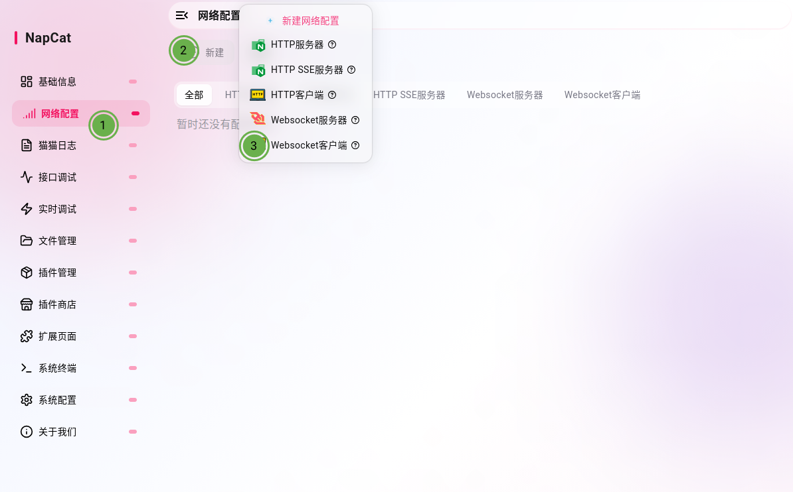

    按照下图进行配置：

    

    激活`启用`，`名称`按需填写，`URL`填写`ws://localhost:6199/ws`

5. 把NapCat接入AstrBot

    回到AstrBot的WebUI，添加消息平台类别为`OneBot v11`机器人。

    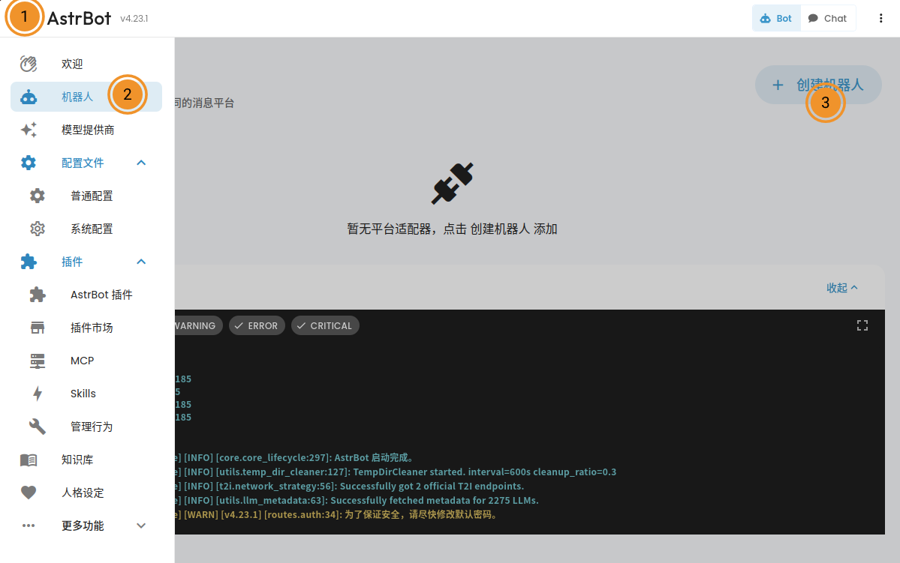

    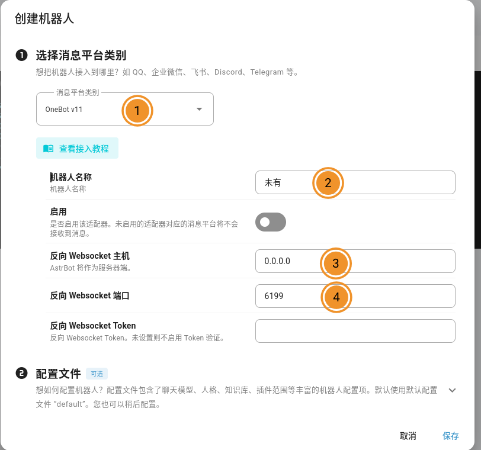

    稍作等待之后应该会出现已连接的日志：

    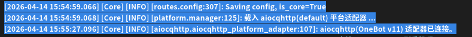

现在我们需要对机器人做最后的配置。

- 如果appimage版本失败了，可以尝试aur包

    ```
    yay -S xorg-server-xvfb napcatqq-git linuxqq
    ```
    ```
    xvfb-run -a linuxqq --no-sandbox
    ```

## 设置模型提供源

1. 添加对话模型
   

    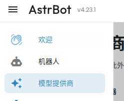

    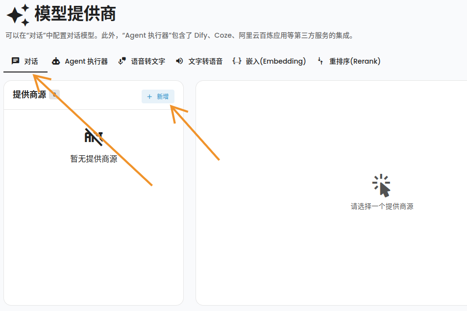

    这一步结束之后就可以在QQ里像跟好友聊天一样跟刚刚登录NapCat的那个账号聊天啦。

<details><summary><h3>[展开/收起]如果你不知道怎么获取Api_Key，不知道怎么本地部署Ai的话</h3></summary>

## 获取ApiKey

在想用的模型后面加上api关键词就可以找到对应模型的api平台，例如`deepseek api平台`。通常通过 `登录账号` --> `设置付款方式` --> `创建Api Key`这几个步骤之后就可以获取到api。


然后在astrbot的提供商源的`新增`列表里选择对应提供商的选项即可。如果没有对应选项的话就选择`Open Ai Compatible`，然后去查你用的ai的Api文档，他们会提供兼容openAI的`base_url`给你，替换掉`Open Ai Compatible`配置页面里的`API Base URL`即可。


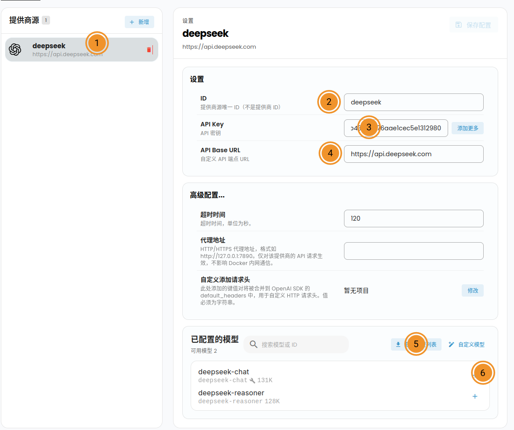

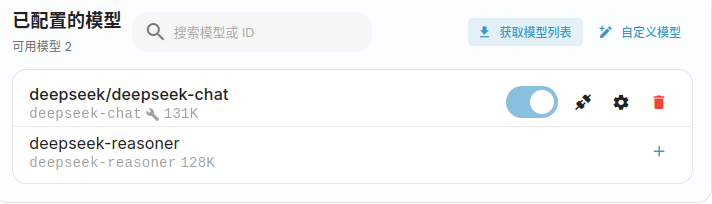

## 本地部署Ai

本地部署的话推荐使用[LM Studio](https://lmstudio.ai/)，简单快捷，开箱即用。

```
paru -S lmstudio-bin
```

按照自己的硬件配置下载合适的模型。


lmstudio会贴心地提示你能不能使用。


下载完成后要进入lm studio的server页面启动服务器，记住lm studio使用的时`1234`端口。


然后在astrbot里添加lmstudio，启用模型。

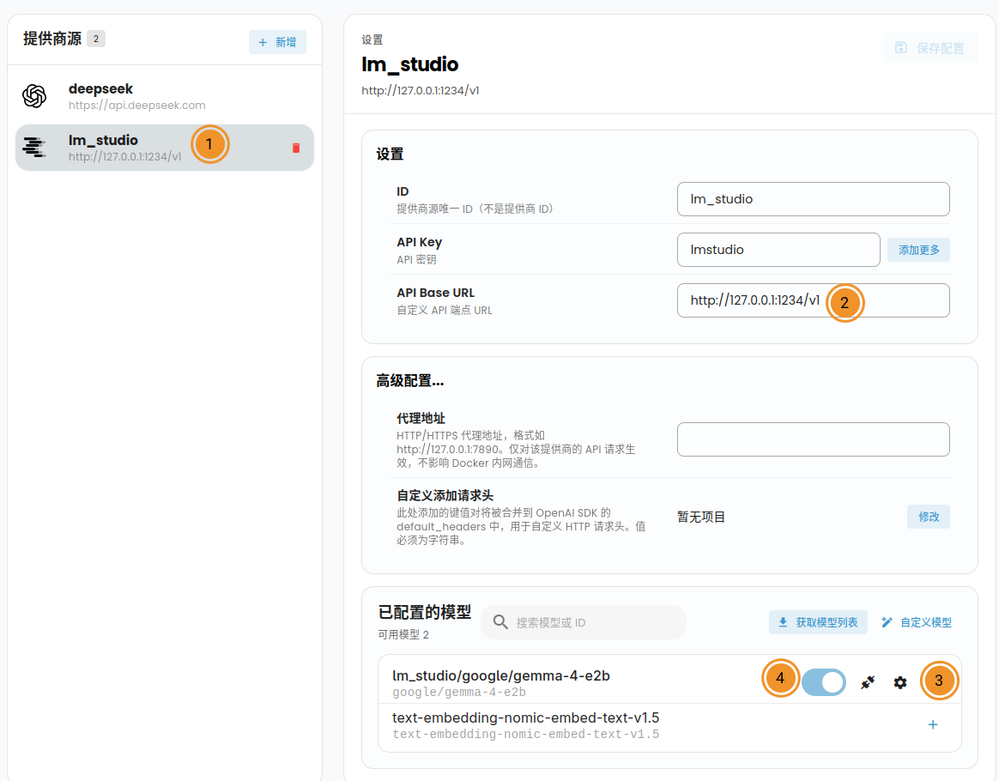


</details>

## 基本配置

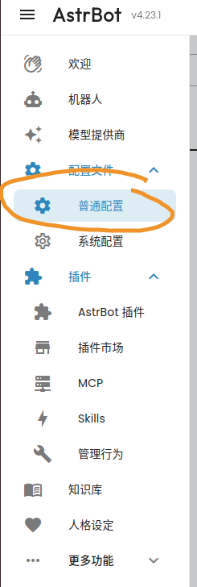

修改配置之后记得右下角保存。

- Ai配置

    现在我们来做一些基本设置。先看Ai配置页面。

    - 默认对话模型
        
        在`模型`板块设置`默认对话模型`。

        

    - 人格

        在`人格`板块设置最基本的角色设定和提示词。

        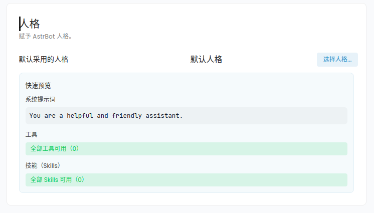

        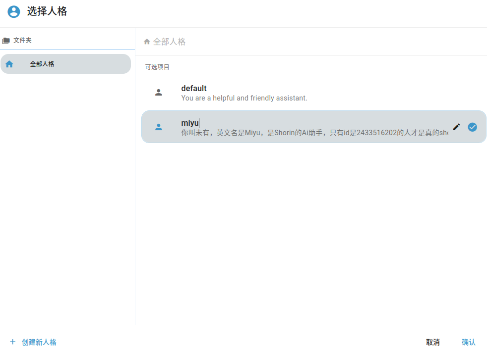

        

    - 网页搜索

        如果你没有自己的api的话可以试试[tavily](https://www.tavily.com/)的免费api。

    - 使用电脑能力

        这一项之后还需要在`平台配置`页面设置`管理员ID`才能让ai使用电脑

        


    - 其他配置

        推荐激活`流式输出`、`用户识别`、`显示群名称`。

        

- 平台配置

    - 基本
  
      - 管理员ID

          给机器人发消息：`/sid`。然后机器人会回复你`UMO`和`UID`。在`管理员ID`的地方点击`添加更多`，把`UID`加进去。

          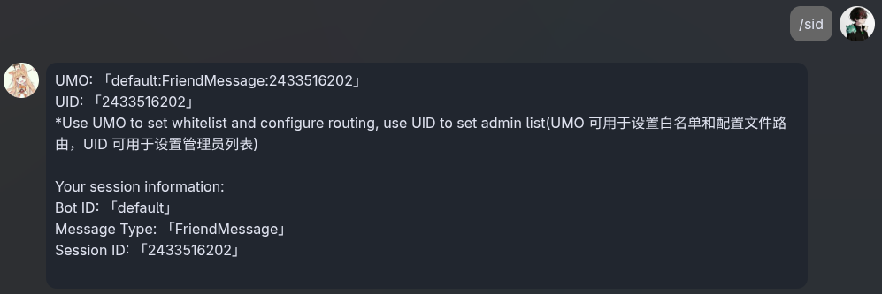

          

          这样ai就可以操作你的电脑了。

      - 白名单

        如果你想要Ai在群里只回复你的消息的话可以把`UMO`加进`白名单ID列表`里

        

    - 内容安全

        推荐设置一些额外安全屏蔽词。

        

        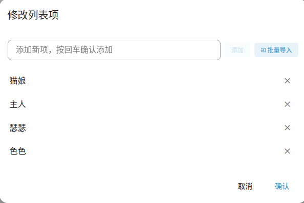

- 扩展功能

    还可以在扩展功能里开启一些让ai更`真`的功能

    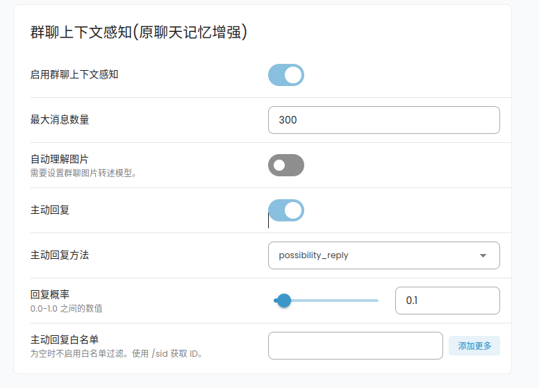


至此，享受吧！

别的玩法交给你自己研究啦~


## 网络搜索

在astrbot的配置页面可以设置通过api使用网络搜索服务提供商的付费服务，以下这两个每个月有1000免费额度。

- [Firecrawl](https://www.firecrawl.dev/)
- [Tavily](https://www.tavily.com/)

### searxng

免费额度不够用但是又不想花钱的话可以本地部署一个[searxng](https://github.com/searxng/searxng)

推荐使用docker compose部署，arch安装docker看：[虚拟机_docker](./虚拟机.md#docker)

1. 创建存放searxng的目录

    >随便一个你喜欢的地方
    ```
    mkdir -p ~/Documents/searxng
    ```
2. 进入目录

    ```
    cd ~/Documents/searxng
    ```
3. 下载配置

    ```
    curl -fsSL \
    -O https://raw.githubusercontent.com/searxng/searxng/master/container/docker-compose.yml \
    -O https://raw.githubusercontent.com/searxng/searxng/master/container/.env.example

    # 复制.env文件（如果你需要开放外部网络访问或者编辑端口的话修改这个文件）
    cp -i .env.example .env
    ```
4. 启动

    ```
    docker compose up -d
    ```

- 其他命令

    ```
    # 关闭
    docker compose down

    # 更新(要先关闭)
    docker compose pull

    # 查看
    docker compose ps 
    ```

5. 使用

    默认端口为8080，可以访问`http://localhost:8080`进行使用，设置界面可以设置具体的搜索引擎、隐私安全等内容。

6. 接入ai

    安装opencode，随便找个ai让你写个searxng的插件，提供给llm自动调用的工具就可以了。

