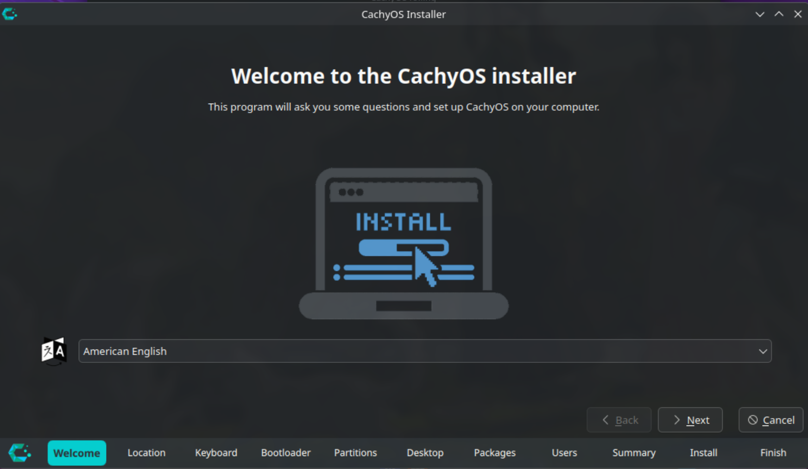
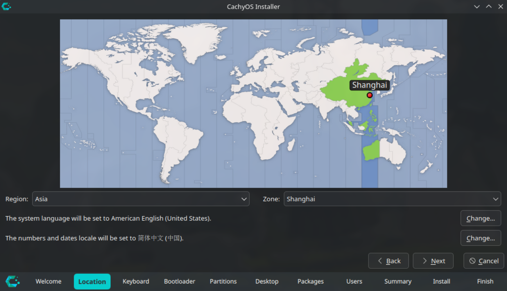
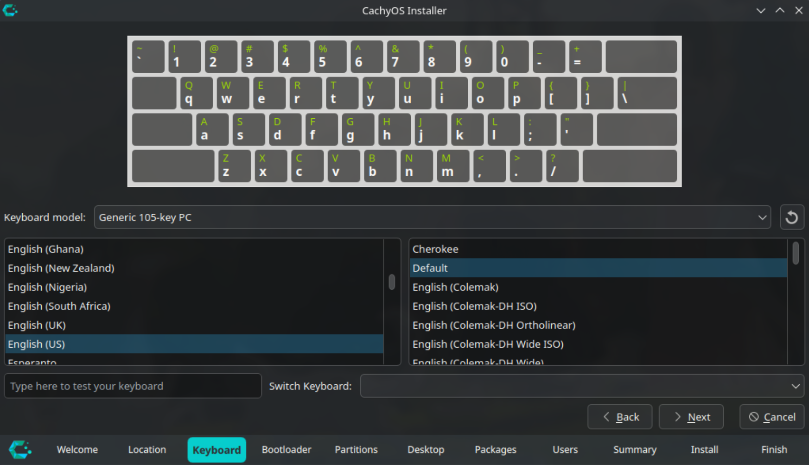
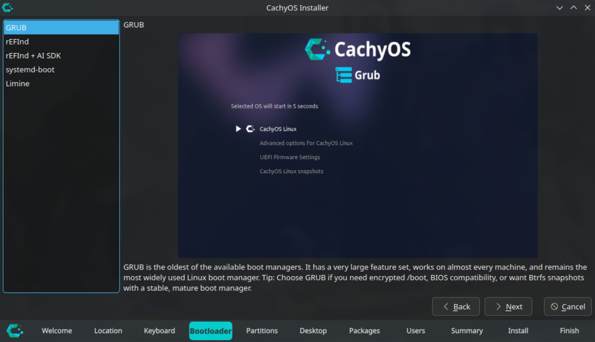
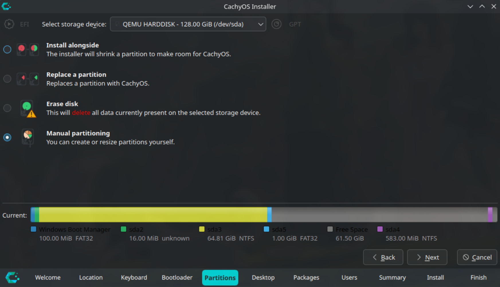
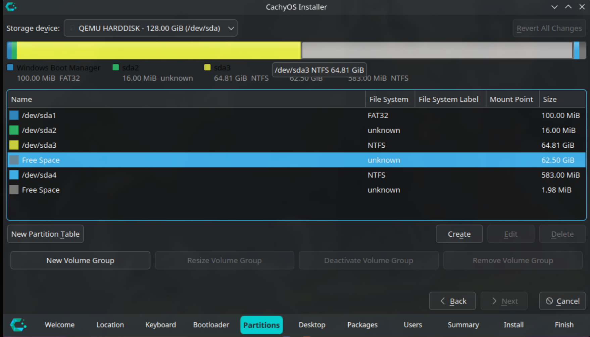
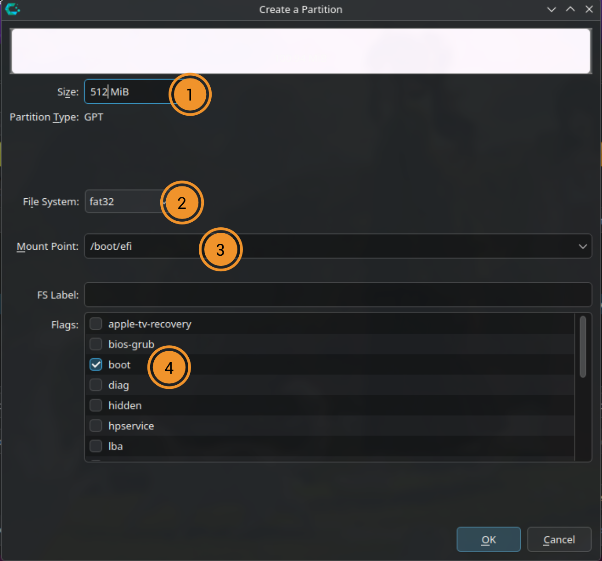
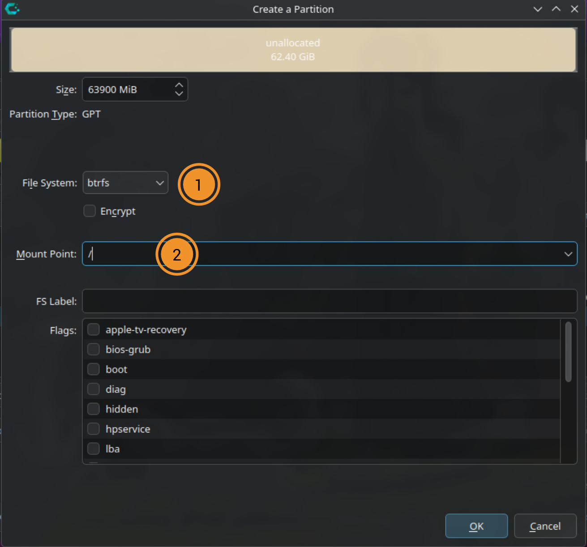
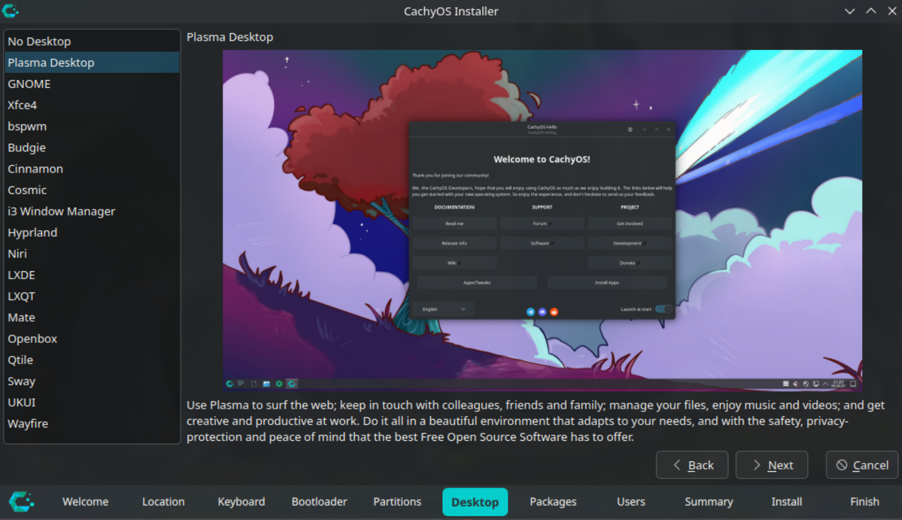
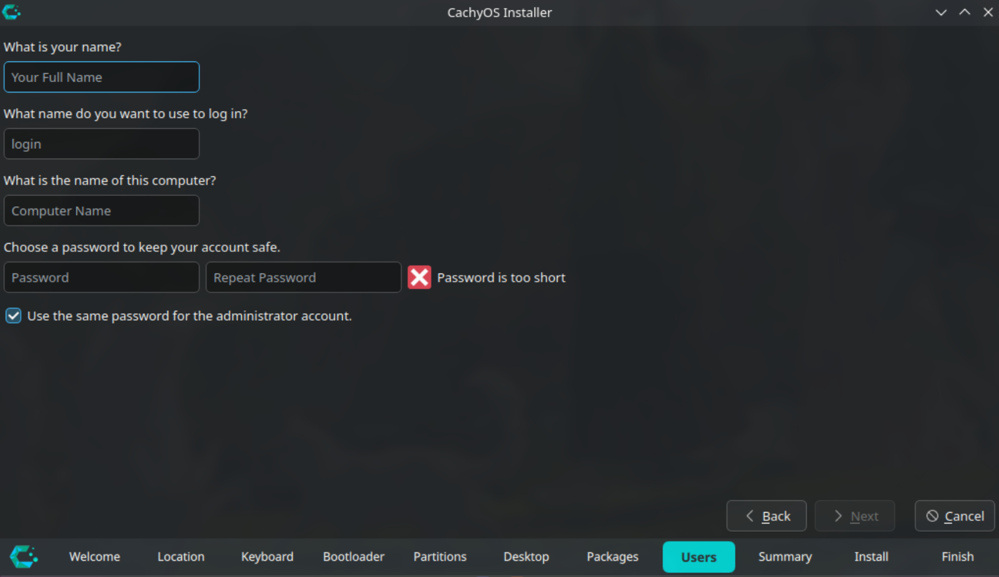

CachyOS是当下最火热的性能特化的arch衍生发行版，本文介绍安装CachyOS的方法和一些必要的配置。

CachyOS分为掌机版（Handheld Edition）和桌面版（Desktop Edition），本文基于桌面版。

## 安装CachyOS

进入live环境之后打开CachyOS hello窗口，点击launch installer开启安装程序。

1. 语言

    

    这里设置的是安装程序的显示语言和之后系统的本地化，请选择英文。系统本地化等装完系统进桌面环境之后再设置为中文，否则使用终端和中文输入法会不方便。

2. 时区

    

    中国对应的时区是Asia/Shanghai

3. 键盘布局

    

    选US或者Chinese都可以

4. bootloader引导加载程序

    

    如果你不知道选哪个请选择GRUB

5. 分区

    

    这一步是重点，根据需求选择。

    - install alongside（并存）

        如果你是一个盘装win+cachy双系统，进live环境前没有事先腾出硬盘空间，且win的efi分区大于512MB，选择这一项。

    - replace a partition（替代一个分区）

        如果你是一个盘装win+cachy双系统，进live环境前事先腾出了硬盘空间，且win的efi分区大于512MB，选择这一项。

    - erase disk（抹掉磁盘）

        如果你使用一整个硬盘安装cachy，选择这一项

    - manual partitioning（手动分区）

        如果以上都不满足，选这一项

6. 手动分区

    分出两个分区，一个启动分区，一个根分区

    - 选择空闲空间，点击creat创建

        

    - 新建启动分区

        CachyOS要求启动分区Size（大小）至少为`512MB`，fileSystem（文件系统）为`fat32`，MountPoint（挂载点）为`/boot/efi`，Flags（标记）为`boot`。

        

    - 新建根分区

        剩下的空闲空间都是跟分区，文件系统推荐`btrfs`，挂载点为`/`

        

7. 桌面环境

    如果没有特殊需求，选择`Plasma Desktop`

    

8. 选择要安装的包

    没有特殊需求默认即可，需要打印机驱动的勾选带print字样的选项

9. 普通用户

    很多软件拒绝在root权限运行，普通用户是必须的。

    

到这一步安装就算是完成了。CachyOS会自动处理好必要的软件源和驱动，开箱即用。

## 必要的配置

安装完成后重启进入系统，登入普通账户。有一些必要的基本配置需要完成

### 更新系统

在cachyos hello点击`apps tweaks`，激活`Cachy Update enabled`，这是任务栏上的更新模块；然后再点击`System Update`确保系统在最新状态。

### 双系统引导

1. 允许搜索其他系统

    按下`Ctrl+Alt+T`打开konsole终端。运行如下命令：

    ```
    kate /etc/default/grub
    ```

    删除倒数第三行开头代表注释的井号：

    ```
    GRUB_DISABLE_OS_PROBER=false
    ```

    按下`Ctrl+S`保存，输入密码。

2. 生成grub.cfg

    接着在终端运行

    ```
    sudo grub-mkconfig -o /boot/grub/grub.cfg
    ```

### 更改系统语言为中文

左下角打开系统设置，在`Region & Language`里把语言改成简体中文，点击右下角`apply`应用，重启之后系统语言就变成中文了。

### 安装中文输入法

1. 安装必要的包

    ```
    sudo pacman -S fcitx5-im fcitx5-chinese-addons
    
    # fcitx5-im是基础包
    # fcitx5-chinese-addons包含了绝大多数中文输入方案
    ```

2. 系统设置

    在`输入和输出-->键盘-->虚拟键盘`里激活`Fcitx5 Wayland启动器`，右下角应用，此时应该就可以使用输入法了，默认切换快捷键是`Ctrl+空格`

    再编辑环境变量让xwayland应用也能使用输入法：

    ```
    kate /etc/environment
    ```

    ```
    XMODIFIERS=@im=fcitx
    ```

3. 修改LC_CTYPE

    LC_CTYPE是系统本地化相关的环境变量，为中文时会导致输入法出现漏字问题。

    ```
    kate ~/.config/plasma-localerc

    # ~/.config/plasma-localerc 这个文件是plasma语言设置相关的文件
    ```

    在`[Formats]`里面添加一行：

    ```
    LC_CTYPE=en_US.UTF-8
    ```

4. 注销重新登录

    在开始菜单点击`会话-->注销`，重新登录即可。

更多输入法信息看：

- [ShorinWiki_中文输入法](中文输入法)
- [ArchWiki_Fcitx5](https://wiki.archlinux.org/title/Fcitx5)
- [ArchWiki_输入法](https://wiki.archlinuxcn.org/wiki/%E8%BE%93%E5%85%A5%E6%B3%95)

### 快照

快照代表着存档和回档，这是btrfs的一大主要功能。CachyOS预装了`snapper`和`btrfs-assistant`。具体的使用方法看：[ShorinWki_快照和系统维护](快照和系统维护)

### 软件安装

看[ShorinWIki_软件安装相关](软件安装相关)

至此，一个功能可供日常使用的CachyOS环境搭建完成。
