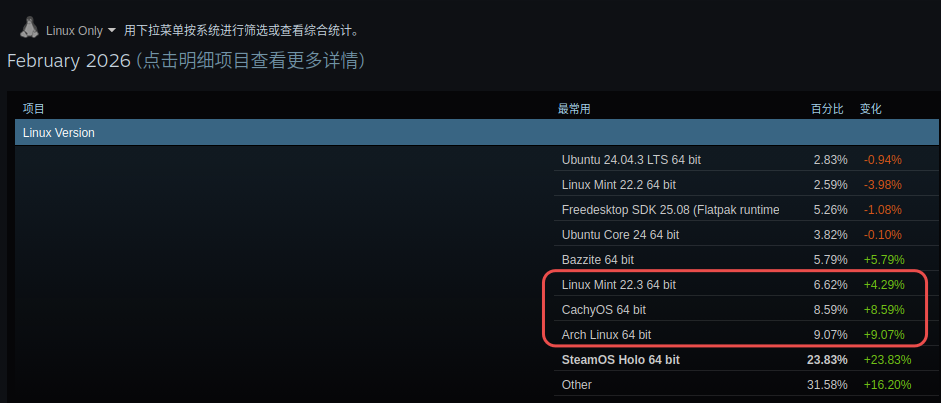
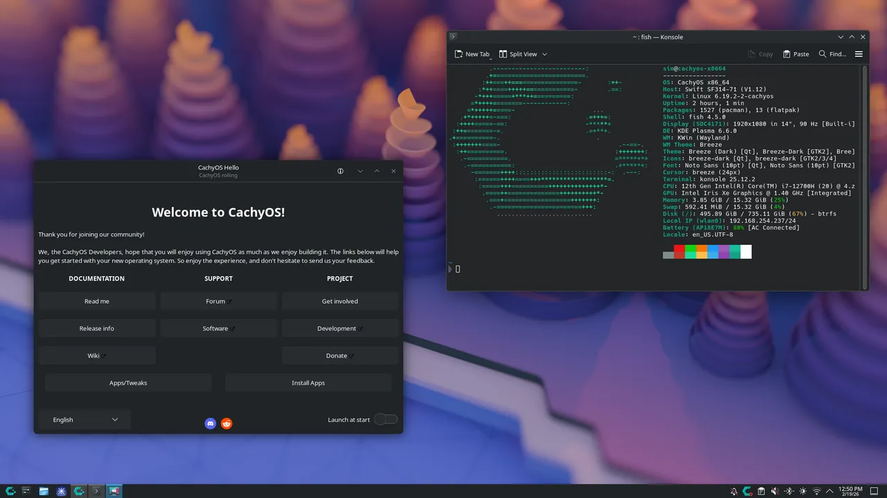
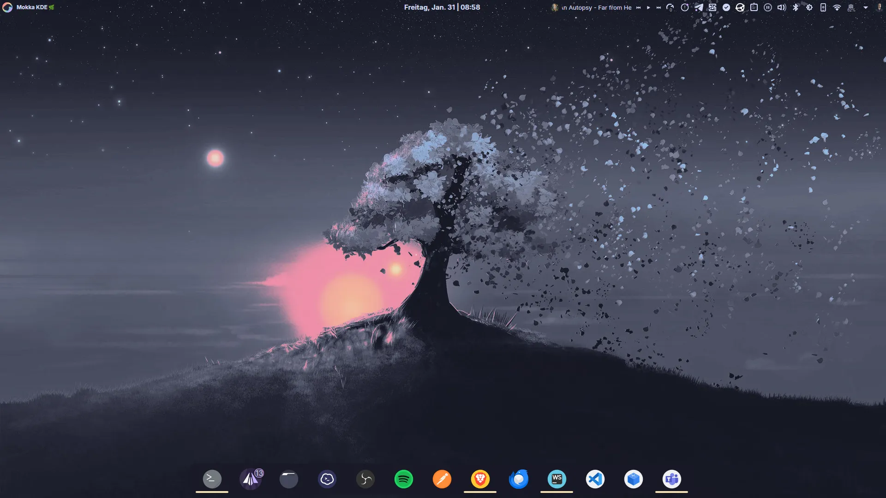

欢迎来到Shorin的LinuxWiki。

如果有错误欢迎指出，如果有更好的方案欢迎分享。

侧边栏有所有重要内容的索引，你可以按需阅读。**萌新建议从上到下依次阅读**（⚠️警告⚠️ 注意编辑时间，太久不编辑的文章可能已经过时）

---

## 给新人的一段话

在正式开始之前，请允许我说一段话。我没有计算机相关的知识和经历，以本地Ai部署为契机尝试Linux，惊叹Linux桌面体验之独特，认为这是极具价值的东西。

Distro Hopping *[注1]* 期间查阅了很多资料，深感中文互联网Linux信息之过时，内容之匮乏，环境之恶臭。在中国，言Linux必及服务器、开发等场景，必对桌面嗤之以鼻，功利至极。这样的观念根深蒂固，甚至Linux用户自己也持有这样的刻板印象。故RedHat、Ubuntu者尊，而Arch者鄙。故卖课出书者众，而桌面内容少有。如果不是英文互联网的信息，这段路途会坎坷得多。这个GitHub仓库的初衷只是方便自己回顾，但是我觉得在这个将桌面Linux妖魔化的大环境下，一定有和我一样的小白对桌面Linux感兴趣但是不知从何下手，故分享了出来。

请谨记，使用Linux和与人交流Linux时应该明确区分服务端和桌面端，明确区分开发场景和日用场景，否则会产生不必要的麻烦和争执。你也可以通过这种方式明确自己的目的，避免浪费精力在不必要的东西上。

>*注 1：`Distro Hopping`，指频繁切换不同Linux发行版。`Distro`是`Distribution`的缩写，意为Linux发行版本，`Hopping`有跳跃的意象。*
 
## 快速开始

- **选择合适的发行版**

    [LinusTechTips的经历](https://www.bilibili.com/video/BV19Pw4zHEE8/?share_source=copy_web&vd_source=1c6a132d86487c8c4a29c7ff5cd8ac50)告诉我们：“好的发行版选择至关重要”。通过[Steam硬件统计排名](https://store.steampowered.com/hwsurvey/Steam-Hardware-Software-Survey-Welcome-to-Steam?platform=linux)选择发行版是我觉得最有效最贴合实际的策略。

    

    除去[基于Arch开发的SteamOS](https://lists.archlinux.org/archives/list/arch-dev-public@lists.archlinux.org/thread/RIZSKIBDSLY4S5J2E2STNP5DH4XZGJMR/)，Arch Linux、Linux Mint和CachyOS常居排行榜前三。
    >SteamOS是专为游戏掌机和主机开发的系统，所以排除。

    如果你是第一次接触Linux，[Linux Mint](https://linuxmint.com/)就是最佳的入门之选，你将拥有最无痛的新手体验。
    >这涉及到Linux显示协议的变迁。现在大部分桌面和发行版都已经转向新的Wayland协议，但是Wayland严格的权限管理加上软件厂商消极的适配开发~~点名批评国产厂商~~，常常导致软件在Wayland上有各种问题，而LinuxMint仍默认使用旧的X11以获得更稳定更完整的使用体验。

    如果想更进一步，获得最佳的桌面端Linux体验，Steam排名第一的[Arch Linux](https://archlinux.org/)是最佳选择。

    Arch的安装可能有些复杂，如果想要安装简单，开箱即用的Arch Linux，以下是我推荐的Arch衍生发行版：

  - [CachyOS](https://cachyos.org/)

    >极致性能。

    当前最热门的发行版。台式机的首选。缺点是稳定性低于原版Arch Linux且功耗略高，不适合注重续航的场景。

    

  - [CatOS](https://www.catos.info/)

    >国产，适合中文用户。

    对中国大陆用户进行了专门调整的Arch衍生发行版。官网的ISO更新可能不及时，建议加Q群:`428382413`。

    

  - [Garuda Linux](https://garudalinux.org/)

    >外观漂亮，快捷稳定。

    我个人最喜欢的Arch衍生发行版，主题设计很棒，还提供了很多便利工具，缺点是资源占用略高。

    

  - [Nyarch Linux](https://nyarchlinux.moe/)

    >二次元不得不品。

    有点玩梗性质的Arch衍生发行版，能开箱即用，~~但是官方说不建议日常使用~~。

    

- **发行版避雷**

  以下是我不建议当作桌面端日用的发行版。

  - [Pop!_OS](https://system76.com/pop/)

    > 仍在测试

    因更换自研桌面导致各种问题，处于转型期，暂时不推荐日用。

  - [Kali Linux](https://www.kali.org/)

    > 拒绝中二病

    面向网络安全的特殊发行版，其[官方文档](https://www.kali.org/docs/introduction/should-i-use-kali-linux/)明确指出不适合日用。同理，像[BlackArch](https://blackarch.org/)这样的发行版也不适合日用。

  - [Debian](https://www.debian.org/)

    > 适合养老

    服务端的霸主，但是对于桌面端来说，它的软件包实在老旧。除非你要绝对的稳定性，否则不推荐使用。

  - [Debian Sid](https://wiki.debian.org/DebianUnstable)

    > 面向开发者的测试分支

    有些人会推荐通过Sid分支兼顾新软件包和Debian生态，但[官方文档](https://wiki.debian.org/DebianUnstable)明确指出Sid不是滚动发行版本，也不保证拥有发行版的质量。如果你要用Debian Sid，请使用[PikaOS Linux](https://wiki.pika-os.com/)。

  - [Deepin](https://www.deepin.org/index/zh)

    > 生态隔离

    对文字办公、影音娱乐来说开箱即用，但是与国际Linux生态隔离，需要额外费一番功夫才能正常使用。国产系统的通病。

### 第一节：[安装任意Linux系统前的准备工作](安装任意Linux系统的前期准备工作)