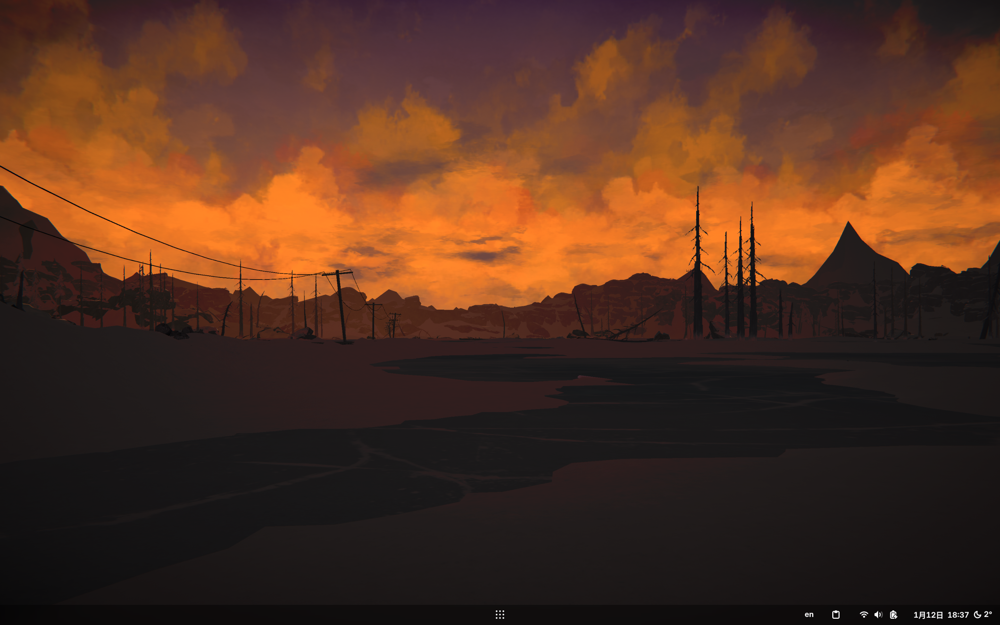
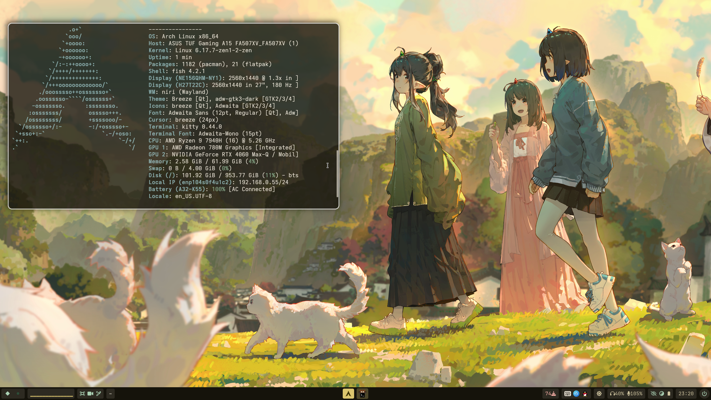
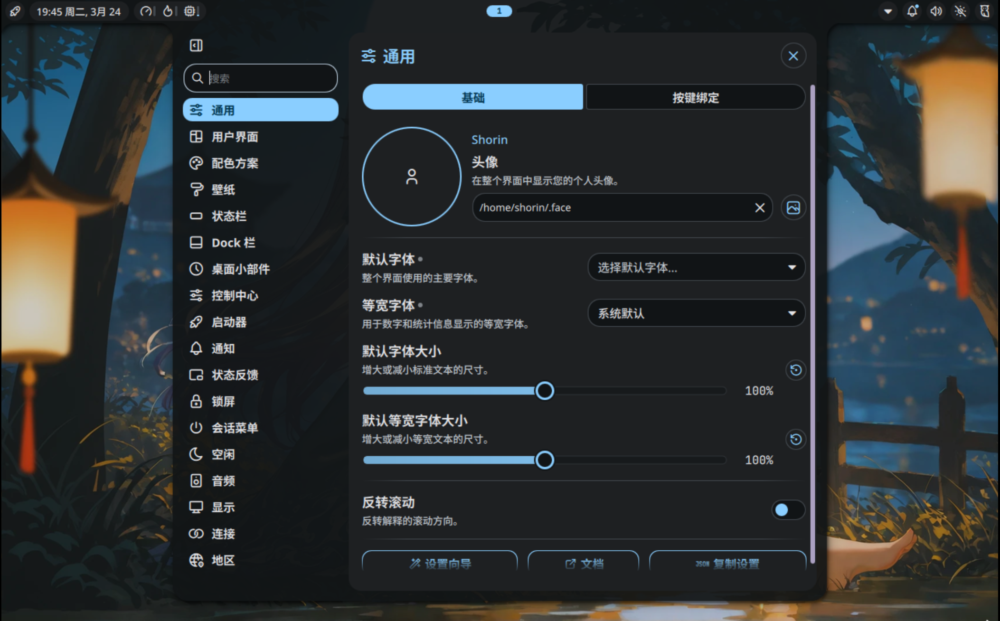
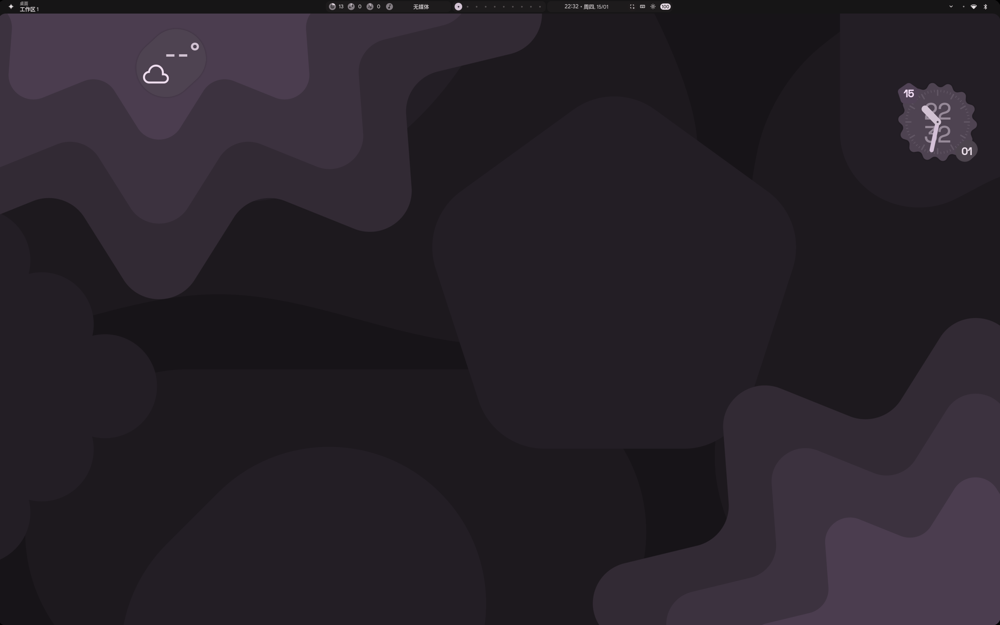
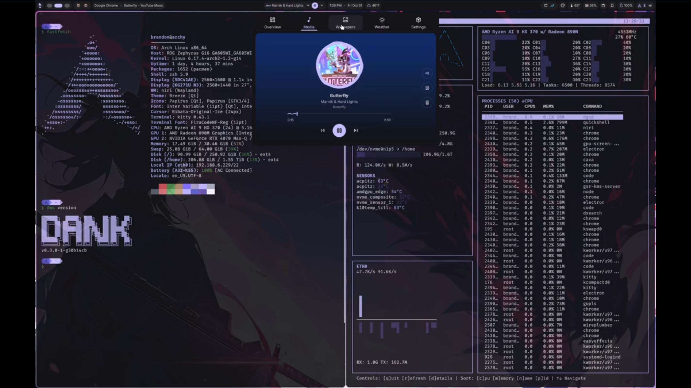
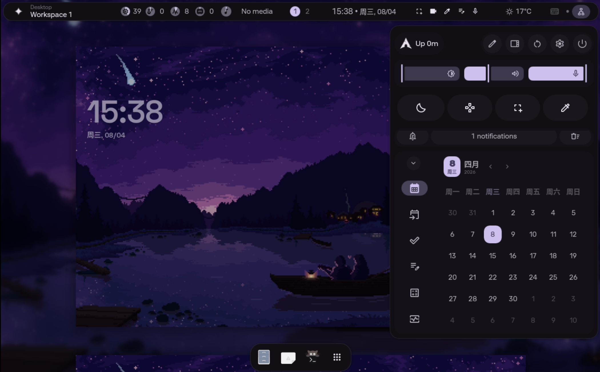
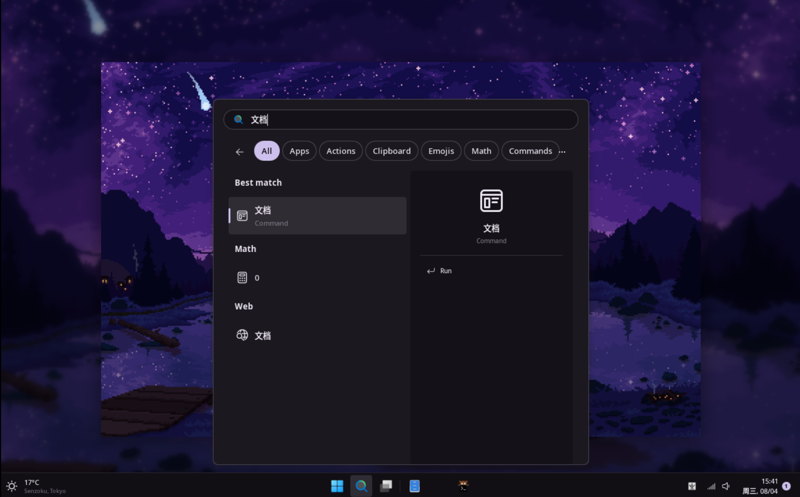
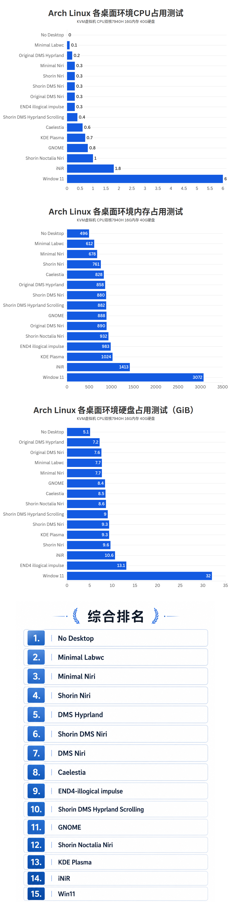

[跳转脚本仓库](https://github.com/SHORiN-KiWATA/shorin-arch-setup)

[视频链接](https://www.bilibili.com/video/BV1Q12tBEE8e/?share_source=copy_web)

---

 目录

- [预览图片](#预览图片)
  - [KDE Plasma](#kde-plasma)
  - [GNOME](#gnome)
  - [Shorin-Niri](#shorin-niri)
    - [Shorin‘s Niri 功能介绍](#shorins-niri-功能介绍)
  - [Quickshell](#quickshell)
- [安装各桌面后的系统资源占用对比](#安装各桌面后的系统资源占用对比)
- [脚本使用方法](#脚本使用方法)
- [注意事项](#注意事项)
- [关于配置更新](#关于配置更新)
- [你可能想进行的修改](#你可能想进行的修改)
- [项目引用](#项目引用)
- [常用软件列表](#常用软件列表)

---

我的一键配置脚本做好啦。功能是用我的配置文件为刚刚安装好的archlinux系统一键完成基础配置，一键安装桌面环境。

## 预览图片

### KDE Plasma

- 

---

### GNOME

- 

---

### Shorin-Niri

- 

- 

#### [Shorin‘s Niri 功能介绍](ShorinNiri功能介绍)

---

### Quickshell

- [Noctalia](https://noctalia.dev/)

    

- [illogical-impulse (end4)](https://github.com/end-4/dots-hyprland)

    

- [DankMaterialShell (DMS)](https://github.com/AvengeMedia/DankMaterialShell)

    

- [Caelestia](https://github.com/caelestia-dots/shell)

    
    
- [iNiR](https://github.com/snowarch/iNiR)

    

    


## 安装各桌面后的系统资源占用对比

> 仅供参考



## 脚本使用方法

1. 安装一个btrfs文件系统的archlinux系统

    不需要任何准备工作。刚刚安装好的Arch就可以运行脚本。

2. 在任意终端或者tty运行以下命令

    ```
    curl -L shorin.xyz/archsetup | bash 
    ```
    有两个需要做出选择的菜单，第一个让你选要装的桌面环境，第二个菜单可以自选部分模块。

    <details close><summary>[展开/收起] 自选模块详细介绍</summary>
   
   - IWD Wifi Backend

        如果你安装了NetworkManager，这一项会将Wifi后端从`wpa_supplicant`修改为`iwd`。以获得更稳定、轻量、快速的wifi体验。

   - Windows Linux Dualboot Setup 双系统配置
       
       如果你的电脑上同时安装了Windows和Linux，并且引导加载程序使用的是Grub，会自动帮你配置双系统的引导。
       
   - Harware Drivers 硬件驱动
       
       这一项会使用`chwd-arch-git`这个包安装上`chwd`，运行`chwd -a`命令自动安装你的硬件需要的驱动
       
   - Grub Themes Grub主题美化

       如果你使用的是Grub，会出现一些可选的Grub主题。

   - Common Apps 常用软件

       启用这一步会在安装完桌面之后安装我推荐的常用软件，可以通过TUI列表挑选你要安装的。对某些软件会进行我预先设计的初始化，例如，选择安装virt-manager会装上一整套的KVM/QEMU虚拟机、选择安装firefox会使用我设计的布局配置并安装去广告扩展、选择安装wine会初始化wine并修复字体问题等......

    </details>
    

3. 阅读教程文件

    安装完成后home目录下或者桌面上会有一个教程文件，请一定阅读。

- 如果出现网络问题可以配置代理：[透明代理](代理)

- 如果打开桌面时报错卡死请检查你的显卡驱动，虚拟机场景请检查3D加速是否启用，`Ctrl+Alt+F2~F8`可以切换到别的终端操作系统。

- 如果安装失败或者后悔了

  - 可以直接重新运行脚本

  - 还可以使用快照回档

      `/usr/local/bin`中安装了`shorin-undochange`和`shorin-de-undochange`两个命令用来回档。

      ```
      # 切换为root
      su -
      
      # 回到对应的时间点
      # 安装前
      shorin-undochange
      
      # 安装桌面前
      shorin-de-undochange
      ```

      或者使用命令行恢复，具体可以看：[快照的使用方法](快照和系统维护)
      
## 注意事项

- shanghai时区会询问要不要刷新镜像源（默认不刷新）。还会询问用哪个flatpak源，默认是上交大。

- 如果安装的是窗口管理器且没有安装过显示管理器，会询问是否配置显示管理器。

- grub存根配置

    如果满足btrfs + esp挂载点不是/boot + grub安装在esp里这三个条件，脚本会自动将`esp/grub/grub.cfg`调整为读取`/boot/grub/grub.cfg`的存根，在启动时自动将`/boot/grub/grub.cfg`的内容嵌套进`esp/grub/grub.cfg`中。这一配置的目的是让grub.cfg能被btrfs回档，避免回档后启动流程和系统不符导致系统挂掉。如果你想更新grub请一定将结果输出到`/boot/grub/grub.cfg`，不要覆盖掉esp里的grub.cfg。

## 关于配置更新

仅Shorin Niri和Shorin DMS Niri支持更新。安装后会有对应的`shorinniri`命令和`shorindms`命令用于管理配置，详情看命令的帮助信息。

## 你可能想进行的修改

- 移除ly显示管理器

    ```
    # 关闭服务
    systemctl disable ly@tty1

    # 删除包
    paru -Rns ly 

    # 重启
    reboot
    ```

- 全局默认编辑器

    ```
    sudo vim /etc/environment
    ```

- 修改或者移除grub主题

    grub主题文件存放在`/usr/share/grub/themes`。运行`sudo shorin change-grub-theme`可以修改主题。

- 移除grub菜单的重启和关机选项

    删除自定义grub配置文件

    ```
    sudo rm /etc/grub.d/99_custom
    ```

- 护眼模式

    想取消的话删除或注释niri配置文件中的wlsunset相关内容即可

    想自定义色温或者经纬度的话修改`.local/bin/toggle-wlsunset`文件

- 移除vscode的matugen主题

    注释掉`~/.config/matugen/config.toml`中关于vscode的内容。

    然后删除`.config/Code/User/settings.json`

- 移除日语输入法

    我安装了fcitx5-mozc日语输入法，如果你不需要的话可以打开fcitx5配置程序删除。删除包使用此命令：

    ```
    yay -Rns fcitx5-mozc
    ```

- 更换图标主题

    图标主题由matugen脚本基于adwaita生成，要禁用才能更换自己想要的图标主题。

    shorin-niri/hyprland和dms编辑`~/.config/matugen/config.toml`。noctalia编辑`~/.config/noctalia/user-templates.toml`，注释掉gtk-folder相关的配置。

- 终端字体太大

    编辑`.config/kitty/kitty.conf`

- gnome扩展设置

    看[我的gnome自定义设置-扩展](我的GNOME自定义设置#功能性扩展)

- 更换awww为swyabg节省内存

    1. `pkill awww`关闭awww。

    2. `sudo pacman -S swaybg`安装swaybg。

    3. 编辑`.config/niri/config.kdl`。

        取消`workspace-shadow{}`里面`off`的注释。再取消`layout {}`里面`background-color "transparent"`的注释。

        再删除或者注释掉以下三行内容

        ```
        // 桌面壁纸的守护进程
        spawn-at-startup "awww-daemon"
        // 总览界面背景壁纸的守护进程
        spawn-sh-at-startup "awww-daemon -n overview"
        // 有聚焦窗口时桌面自动模糊的脚本
        spawn-at-startup "~/.config/scripts/niri_auto_blur_bg.sh"
        ```

        再新写入一行`spawn-at-startup "waypaper" "--restore"`

    4. 配置waypaper

        `vim .config/waypaper/config.ini`

        删除`post_command`后面调用的脚本，只留下`post_command = $HOME/.config/scripts/matugen-update.sh $wallpaper`

        最后打开waypaper，z键调出ui，把awww换成swaybg，切换一张自己喜欢的壁纸

- 删除大写锁定的osd显示

    也可以节省内存

    ```
    systemctl disable --now swayosd-libinput-backend.service
    ```

    再删除或注释`.config/niri/config.kdl`中`swayosd-server的`自动启动

    再删除或注释`.config/matugen/config.toml`中的swayosd相关内容。

## 项目引用

- grub主题

    [CyberGRUB-2077](https://github.com/adnksharp/CyberGRUB-2077)

    [mimegrub](https://github.com/Lxtharia/minegrub-theme)

    [Crossgrub](https://github.com/krypciak/crossgrub)

    [OldBIOS](https://github.com/Blaysht/grub_bios_theme)

    [Blue Screen of Life](https://github.com/harishnkr/bsol)

- waybar

    [mechabar](https://github.com/sejjy/mechabar)

## 常用软件列表

这里是所有的常用软件，GUI是图形化交互软件，TUI是基于终端的交互软件。如果你有不需要的可以自己`yay -Rns 包名`删除。如果有残留的快捷方式可以查看`~/.local/share/applications`或者`/usr/share/applications`目录删除对应的.desktop文件。

<details close><summary>常用软件列表</summary>

- 互联网与社交

    | 软件包                      | 说明                        |
    | :-------------------------- | :-------------------------- |
    | `firefox` `python-pywalfox` | 火狐浏览器和主题同步        |
    | `linuxqq-appimage`          | (AUR) QQ                    |
    | `wechat-appimage`           | (AUR) 微信                  |
    | `flclash-bin`               | (AUR) 网络代理工具          |
    | `localsend`                 | 局域网传输神器              |
    | `nm-connection-editor`      | 高级网络配置管理            |
    | `transmission-gtk`          | 种子下载器                  |
    | `video-downloader`          | (AUR) 视频下载器 (B站/油管) |

- 游戏 (Gaming)

    | 软件包                      | 说明                            |
    | :-------------------------- | :------------------------------ |
    | `steam`                     | 游戏平台                        |
    | `lutris`                    | wine前缀和游戏库管理            |
    | `heroic-games-launcher-bin` | Epic/GOG 游戏管理               |
    | `protonplus`                | Proton 版本管理                 |
    | `mangohud`                  | 游戏性能监控浮层（Afterburner） |
    | `mangojuice-bin`            | (AUR) Mangohud 配置 GUI         |
    | `gamescope`                 | 游戏窗口合成器                  |
    | `lsfg-vk-bin`               | (AUR) 小黄鸭游戏补帧工具        |
    | `wine`                      | 运行 Windows 程序               |

- 生产力与多媒体

    | 软件包                                           | 说明                              |
    | :----------------------------------------------- | :-------------------------------- |
    | `visual-studio-code-bin`                         | (AUR) VS Code 代码编辑器          |
    | `neovim`                                         | 现代化的 Vim 终端编辑器           |
    | `lazyvim`                                        | 优秀的 Neovim 预设配置            |
    | `opencode`                                       | 开源 AI 助手                      |
    | `mpv`                                            | 视频播放器                        |
    | `imv`                                            | 图片查看工具                      |
    | `obs-studio`                                     | 推流与录屏                        |
    | `upscaler`                                       | 图片无损放大 GUI                  |
    | `virt-manager` `qemu-full` `swtpm` `virt-viewer` | KVM 虚拟机管理                    |
    | `com.github.wwmm.easyeffects`                    | （flatpak）音频特效 (降噪/均衡器) |

- 系统工具

    | 软件包                          | 说明                             |
    | :------------------------------ | :------------------------------- |
    | `nmtui`                         | TUI网络连接配置工具              |
    | `mission-center`                | 系统监视器 (win11风格)           |
    | `btop`                          | TUI系统监视器                    |
    | `gdu`                           | TUI磁盘占用分析工具              |
    | `baobab`                        | GUI磁盘占用分析工具              |
    | `gparted`                       | 磁盘管理工具                     |
    | `gnome-font-viewer`             | 字体管理器                       |
    | `thunar`                        | GUI文档管理器                    |
    | `yazi`                          | TUI文档管理器                    |
    | `fcitx5-mozc`                   | 日语输入法                       |
    | `rime-wubi`                     | 五笔输入法                       |
    | `lact`                          | GPU 控制工具                     |
    | `pavucontrol`                   | 音频配置 GUI                     |
    | `flatseal`                      | Flatpak 权限管理                 |
    | `it.mijorus.gearlever`          | （flatpak）AppImage 管理器       |
    | `io.github.fabrialberio.pinapp` | （flatpak） .desktop文件编辑工具 |
    | `bazaar`                        | flatpak软件商城                  |
    | `gnome-clocks` `gnome-calendar` | 时钟和日历                       |
    | `file-roller`                   | 压缩解压缩                       |

</details>
