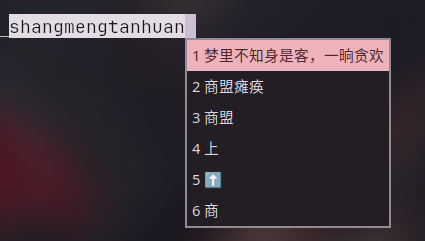

目录

- [fcitx5-rime](中文输入法#fcitx5)
- [ibus-rime](中文输入法#ibus)
- [输入法异常的解决办法](中文输入法#输入法异常的解决办法)

---

常用的输入法框架有fcitx5和ibus，fcitx5更现代，功能更多，建议使用。不同桌面配置方法会略有不同，注意区分。

## fcitx5

1. 安装基础框架

    ```bash
    sudo pacman -S fcitx5-im

    # fcitx5-im 包含了fcitx5的基本包
    ```

2. 安装中文输入方案

    你可以**自己选择要安装的输入方案**，因为我使用全拼，所以本文主要是全拼方案的教程。

    - 中文输入合集`fcitx5-chinese-addons`

      这里面包含了所有常用的中文输入方案（拼音、五笔、双拼等等）。安装简单，但是输入效果一般，不推荐使用。

      ```
      sudo pacman -S fcitx5-chinese-addons
      ```

    - RIME中州韵引擎+雾凇拼音

      现有两大方案，万象和雾凇。万象的全拼分词效果很差，所以全拼用户强烈推荐使用雾凇，双拼用户推荐使用万象。（PS：如果出现锁英文的异常，按右shift也许可以解决）

      1. 安装RIME（中州韵）+雾凇拼音

          ```
          sudo pacman -S fcitx5-rime rime-ice-git
          ```

            >`fcitx5-rime`是输入法引擎

            >`rime-ice-git` 雾凇输入方案，这个包需要从aur或者archlinuxcn安装

            >其他方案：`rime-wanxiang-pinyin`万象拼音（这个包在archlinuxcn上）；`rime-wanxiang-flypy`万象小鹤双拼（archlinuxcn源）；`fcitx5-mozc`日语输入法；`rime-wubi`五笔输入法。

          现在打开`fcitx5-configtool`就可以添加`rime（中州韵）`到输入法列表中了，添加完成后重启输入法会自动初始化。默认的输入方案是繁体的`明月拼音`，按下F4可以打开设置菜单调整为简体。下面我们编辑配置配置文件将默认输入方案改成雾凇拼音。

      2. 编辑配置文件启用rime雾凇拼音

            ```
            mkdir -p ~/.local/share/fcitx5/rime
            vim ~/.local/share/fcitx5/rime/default.custom.yaml 
            ```

            >第一行命令`mkdir -p`检查文件夹是否存在，不存在的话创建。第二行编辑配置文件
      
            写入以下内容设置rime的默认方案为雾凇拼音：

            ```
            patch:
              # 这里的 rime_ice_suggestion 为雾凇方案的默认预设
              __include: rime_ice_suggestion:/
            ```
            重启输入法之后默认输入方案就变成雾凇拼音了。

      3. 可选：F4在多个输入方案间切换

            用`ls /usr/share/rime-data/*.schema.yaml`命令可以看到当前所有可用的输入方案，去掉文件名的`.schema.yaml`就是`schema`名，写进`default.custom.yaml`后可以在F4菜单里切换不同的输入方案，以下是示例（注意缩进，rime的配置文件对缩进很严格）：

            ```
            patch:
              schema_list:
                - schema: luna_pinyin_simp
                - schema: rime_ice
                - schema: wanxiang
                - schema: double_pinyin_flypy
                - schema: wubi86
                - schema: bopomofo
            ```
            > `luna_pinyin_simp` 是rime自带的明月拼音；`wanxiang`是万象拼音；`double_pinyin_flypy`是小鹤双拼（由`rime-ice-git`提供）；`bopomofo`是注音输入法。
            
      4. 可选：配置输入法模型

            推荐给雾凇拼音接入万象的语法模型，可以提高长句联想效果。你可以现在尝试打`苍茫的天涯是我的爱`，大概率会打出`苍茫的填鸭式我的爱`，如果配置了语法模型就可以解决这个问题。

            1. 安装模型
             
               可以直接从aur或者archlinuxcn安装：
               ```
               yay -S rime-wanxiang-gram-zh-hans
               ```
               >或者从github手动下载：[点击此处下载模型](https://github.com/amzxyz/RIME-LMDG/releases/download/LTS/wanxiang-lts-zh-hans.gram)，下载完成后把模型放在`~/.local/share/fcitx5/rime/`
            
            2. 编辑雾凇拼音的配置文件
               
               ```
               vim ~/.local/share/fcitx5/rime/rime_ice.custom.yaml
               ```
               
               写入：
               
               ```
               patch:
                 "grammar/language": wanxiang-lts-zh-hans
               ```
               
            3. 重新启动输入法
            
               现在再打`苍茫的天涯是我的爱`试试。
            
      5. 可选：[接入LLM大模型进行云拼音](https://github.com/SHORiN-KiWATA/rime-llm-translator)
      
            这是我自己的项目，功能是给Rime输入法接入大模型进行拼音联想。把拼音传给大模型，让大模型猜出正确的句子，一键安装，TUI图形化界面修改配置，感兴趣的可以试试。
    
3. 配置环境变量

   ```
   sudo vim /etc/environment
   ```

   不同的桌面设置方法不同

   - GNOME的话写入

     ```
     XIM="fcitx"
     GTK_IM_MODULE=fcitx
     QT_IM_MODULE=fcitx
     XMODIFIERS=@im=fcitx
     ```

     >`GTK_IM_MODULE=fcitx QT_IM_MODULE=fcitx XMODIFIERS=@im=fcitx`这三个是最主要的环境变量

     >`XIM="fcitx"`是因为我在微信的某个版本出现输入法无法使用的情况，设置这个解决了

      如果出现吞字问题可以尝试用`XDG_CURRENT_DESKTOP=GNOME`环境变量解决

   - KDE/wayland合成器的话写入

     ```
     XMODIFIERS=@im=fcitx
     ```

   - wayland合成器
     
      在配置文件里设置环境变量，例如：

      - niri

        ```
        environment {
              XMODIFIERS "@im=fcitx"
        }
        ```

      - hyprland

        ```
        env = XMODIFIERS,@im=fcitx
        ```

4. 调整系统设置

   - GNOME的话

      1. 打开fcitx5配置添加rime

      2. 安装扩展

          商店搜索extension，安装蓝色的extensionmanager，然后在扩展商店安装[input method panel](https://extensions.gnome.org/extension/261/kimpanel/)扩展。

   - KDE的话

     1. 打开`系统设置` > `键盘` > `虚拟键盘`， 选择`fcitx5 wayland启动器`，记得`应用`。
     2. `系统设置` > `语言和时间` > `输入法`，添加`rime（中州韵）`。 `配置全局选项`可以设置切换输入法的快捷键。`配置附加选项`可以进行一些自定义设置。

   - wayland合成器的话

     1. 打开`fcitx5配置`进行设置

     2. 在合成器配置文件里设置自动启动fcitx5

        - niri

          ```
          spawn-at-startup "fcitx5"
          ```
        - hyprland

          ```
          exec-once = fcitx5
          ```

5. 可选：美化

   浏览器搜索fcitx5 themes，下载自己喜欢的主题放到`~/.local/share/fcitx5/themes`目录下。在`fcitx5配置`里的`经典用户界面`里进行设置。

6. 干净删除fcitx5

   1. 删除包

      ```
      sudo pacman -Rns fcitx5-im fcitx5-rime rime-ice-git
      ```
      > `fcitx5-im fcitx5-rime rime-ice-git` 应为你实际是用的包的名字。

   2. 删除配置文件

      ```
      rm -rfv ~/.config/fcitx5 ~/.local/share/fcitx5
      ```

   3. 清理之前配置的环境变量

### RIME 自定义词库

RIME 的词库是离线的，无法打出热词，这个时候就需要自定义词库。如果你觉得默认的联想不适合你的使用场景，也可以自定义词库。具体方法如下，了解方法之后你甚至可以给 AI 提供素材，根据你的使用场景创建专属于你自己的自定义词库。

1. 在 `~/.local/share/fcitx5/rime` 目录下新建 `custom_phrase.txt`

    ```
    vim ~/.local/share/fcitx5/rime/custom_phrase.txt
    ```
2. 按照这个格式写入自定义词库：`词语<TAB>ciyu<TAB><可选设置权重>`

    > `<TAB>` 代表制表符（TAB键）分割，不能使用空格；`ciyu` 是具体单词或者短语的拼音；`<可选设置权重>` 代表该词在候选列表中的排序高低，数字越大越高

    以下是一个示例配置：

    ```
    # encoding: utf-8
    # 注释以 # 开头
    异环	yihuan	100
    异幻  yihuan  99
    腾讯	tx
    梦里不知身是客，一晌贪欢	shangmengtanhuan
    ```
3. 重启输入法

    ```
    fcitx5 -r
    ```  

效果如图

  - 权重排序

    

  - 自定义短语

    


### KDE/wayland合成器用户接着看[输入法异常的解决办法](#输入法异常的解决办法)

## ibus

kde/wayland合成器用fcitx5就可以。gnome和ibus兼容性更好，如果有需要可以更换。

因为是次要内容所以放在附录了，[点击此处跳转](附录#ibus)。

## 输入法异常的解决办法

- 修改locale解决大部分问题

可以运行`locale`命令查看当前的locale环境变量都是什么。

```
locale
```

`LC_CTYPE`环境变量设置为`zh_CN.UTF-8`时会导致输入法出现漏字现象，把它改成英文（⚠️注意：此变量为英文时可能会导致steam等应用完全不能使用中文输入法，遇到的话单独设置`LC_CTYPE`为中文就行。）

在自己桌面环境对应的设置locale或者环境变量的地方修改locale。我们可以把`LANG`设置为中文，单独设置`LC_CTYPE`为英文。也可以把`LANG`设置为英文，用`LC_MESSAGES`设置界面为中文。

```
LANG=zh_CN.UTF-8
LC_CTYPE=en_US.UTF-8
```

或者

```
LANG=en_US.UTF-8
LC_MESSAGES=zh_CN.UTF-8
# 想让时间以中文显示要设置LC_TIME为中文
```

>不知道写在哪就写在`/etc/environment`。

如果你在某些软件完全无法使用输入法的话，需要设置额外的环境变量或者启动参数，继续往下看。

### 从快捷方式打开的话（.desktop）

编辑软件对应的.desktop文件，修改`Exec=`后面的命令。这些文件存放在`/usr/share/applications`和`~/.local/share/applications`。不要直接修改`/usr/share/applications`里的文件，复制一份到用户空间再改。

- 对于QT和GTK应用

  ```
  Exec= env GTK_IM_MODULE=fcitx QT_IM_MODULE=fcitx 
  ```

  > `env`设置启动时的环境变量

- 对于chromium和electron应用

  以qq为例，在`linuxqq 【此处】%U`添加命令行参数

  ```
  --ozone-platform=wayland
  ```

  不行的话设置：

  ```
  --enable-features=UseOzonePlatform --ozone-platform=wayland --enable-wayland-ime
  ```

  示例：

  ```
  Exec=env DESKTOPINTEGRATION=false /usr/bin/linuxqq --no-sandbox --ozone-platform=wayland %U
  ```

### 从终端命令打开的话

上面的设置只对快捷方式打开生效，从终端用命令打开的话不一定生效。解决办法是编辑shell的配置文件单独设置alias。

- zsh/bash

  编辑`home`目录下的`.zshrc`或`.bashrc`文件，根据使用的shell而定。

  - QT或GTK应用（以typora为例）

    ```
    alias typora='GTK_IM_MODULE=fcitx QT_IM_MODULE=fcitx typora'
    ```

  - chromium和electron应用（以vscode为例）

    ```
    alias code='code --enable-features=UseOzonePlatform --ozone-platform=wayland --enable-wayland-ime'
    ```

- fish

  fish的话有两种方法，一种是`abbr`，另一种是`function`。

  - abbr

    abbr是自动替换命令

    ```
    abbr typora 'GTK_IM_MODULE=fcitx QT_IM_MODULE=fcitx typora'
    ```

    ```
    abbr code 'code --ozone-platform=wayland'
    ```

  - function

    function更改命令的功能

    ```
    function typora
     env GTK_IM_MODULE=fcitx QT_IM_MODULE=fcitx typora $argv
    end
    ```

    ```
    function code --description ‘启动code’
     exec code --ozone-platform=wayland $argv
    end
    ```

    > `function`是函数，`typora`是要运行的命令，``--description ''``是描述，中间是这个命令的具体内容`exec`是运行后退出终端，如果要保持终端开启的话把`exec`换成`command`，``$argv``传递``typora``命令后的选项和参数（有些应用不需要），`end`结尾。

### 其他方法

[librime 补丁](https://github.com/busyoGG/librime-patch)这里有一个修复补丁的项目，我没试过，有兴趣的可以自己试试。

## 下一节：[软件安装相关](软件安装相关)
