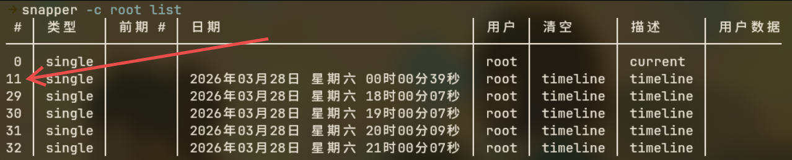
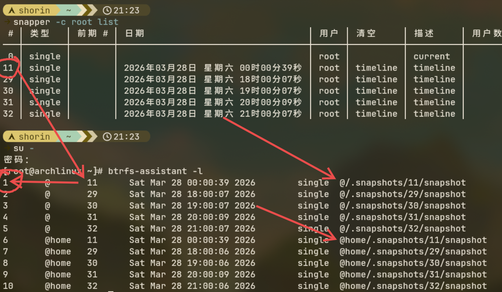

目录

- [snapper](快照和系统维护#snapper)
- [回档方法](快照和系统维护#回档方法)
- [滚挂和良好的系统使用习惯](快照和系统维护#关于滚挂和良好的系统使用习惯)
- [downgrade回退更新](快照和系统维护#扩展内容downgrade)
- [拓展：手动快照回档](快照和系统维护#拓展内容手动快照回档)

现在我们已经完成了安装桌面环境前的所有准备工作，为了方便尝试不同的桌面，可以创建一个快照当作存档点，想玩别的随时回档。另外，**养成习惯，每次做自己不了解的事情之前都存个档**，如果出了问题或者后悔了可以恢复到快照时的状态。

## snapper

opensuse开发的快照软件，超级好用。

1. 安装

   ```
   sudo pacman -S snapper btrfs-assistant grub-btrfs inotify-tools
   ```

   `snapper` 是主程序；

   `btrfs-assistant` 是GUI（图形化交互界面），同时提供了几个简单的命令，进一步简化快照回档需要的操作。我们还没有安装桌面环境，但是肯定会用到，先装上。

   `grub-btrfs inotify-tools` 在创建快照的时候自动在grub菜单里添加快照启动项

   可选：`snap-pac` 利用钩子在进行pacman命令的时候自动创建快照；

2. 重启电脑用新的initramfs进入系统

   ```
   reboot
   ```

3. 激活快照启动项服务

   如果你是通过`/efi/grub/grub.cfg`存根读取`/boot/grub/grub.cfg`的方式配置的grub引导，需要进行额外操作，看：[附录：Grub在btrfs文件系统的最佳配置方法](附录#grub在btrfs文件系统的最佳配置方法)。

   ```
   sudo systemctl enable --now grub-btrfsd
   ```

4. 创建快照配置

   ```
   sudo snapper -c root create-config /
   ```

   `-c root`指定要使用的配置，由于该配置不存在，所以`create-config`创建，快照范围是`/`。

   然后用同样的方式创建home的配置：

   ```
   sudo snapper -c home create-config /home
   ```

5. 设置合理的快照策略

   - 获取当前设置

      ```
      sudo snapper -c root get-config
      ```

   - 修改设置

      可以使用`set-config`选项，但是一个个设置太麻烦了，建议直接编辑文件

      ```
      sudo vim /etc/snapper/configs/root
      ```

      以下是我的设置：

      `ALLOW_GROUPS="wheel"`允许wheel组的用户无须`sudo`就可以操作快照

      `NUMBER_LIMIT="10"` 设置最多保存10个快照，超出后会按照时间顺序删除旧快照。

      `TIMELINE_LIMIT_HOURLY="3"`每隔一小时创建的快照保存3个。

      `TIMELINE_LIMIT_DAILY="1"`每日快照保存1个。

      其他的`TIMELINE_LIMIT`数量都设置为0。这样就仅保存三个小时前的状态和昨天的状态。

      接着对home的快照配置进行一样的修改

      ```
      sudo vim /etc/snapper/configs/home
      ```

6. 开启按时间自动创建快照和自动清理

   ```
   sudo systemctl enable --now snapper-timeline.timer
   sudo systemctl enable --now snapper-cleanup.timer
   ```

7. 创建快照

   分别创建home和root的快照。

   ```
   snapper -c root create -d "before desktop"
   snapper -c home create -d "before desktop"
   ```

   `create`创建快照，`-d (description)`添加自定义描述。我们这里是安装桌面之前，所以描述为before desktop。

8. 生成grub菜单入口

   要至少运行一次`grub-mkconfig`生成grub菜单的快照启动项入口：

   ```
   sudo grub-mkconfig -o /boot/grub/grub.cfg
   ```

现在就配置好快照啦。`reboot`重启可以看到快照启动项。

### 回档方法

- btrfs-assistant命令行（推荐）

   0. 切换至root

      以普通用户`sudo`运行可能会出现环境问题，建议切换到root。

      ```
      su -
      ```

   1. 确认要使用的快照的**snapper序号**

      ```
      snapper -c root list
      ```

      可以使用`grep`筛选快照

      ```
      snapper -c root list | grep "Before"
      ```

      假设我要用的快照的sanpper序号是`11`

      

   2. 用snapper序号找到对应的**btrfs-assistant序号**

      ```
      btrfs-assistant -l
      ```

      在下图这个例子中，snapper序号为`11`的root快照对应着btrfs-assistant的序号`1`。

      

      注意一个细节，这条命令会把home和root的快照排在同一个列表里。图中snapper序号为`11`的home快照对应着btrfs-assistant序号`6`（这意味着btrfs-assistant序号1~5是root快照，6往后是home快照）。

   3. 回档

      ```
      btrfs-assistant -r 1
      ```

      这里的数字是要使用的快照的**btrfs-assistant序号**。

- btrfs-assistant图形界面

   <details close><summary>此时还没有安装桌面环境，你可以后续回来看</summary>

   >如果你要从命令行打开 btrfs-assistant，必须使用 `btrfs-assistant-launcher`，仅使用 `btrfs-assistant` 命令的话不会调用 polkit 提权。

   1. 创建配置

      打开 btrfs assistant，切换到`snapper settings` 页面。我们创建子卷的时候至少创建了一个 `@` 子卷和一个 `@home` 子卷，所以需要两个 `config（配置）`。

      - root 根目录快照

         点击 `new config` 新建配置，`config name` 写 `root`，`backup path` 选择 `/`，然后点击 `save` 保存。

         接着进行一些按照时间自动生成快照的设置。`systemd unit settings` 里面有三个服务。 `timeline` 是按照时间计划自动创建快照；`cleanup` 是快照数量达到 `number` 设定的数量上限之后自动清理快照；`boot` 是每次开机自动创建快照。按需设置，设置完记得点 `apply`。

      - home 目录快照

         按照同样的方法创建一个 home 目录的配置。

   2. 创建快照

      到 `snapper` 页面，`select config` 选择配置，要创建 root 子卷的快照就选择刚刚创建的名为 `root` 的配置。点击 `new` 创建快照，`description` 是快照的自定义文字描述（注释）。

   3. 使用快照进行恢复

      `snapper` 页面--> `Browse/restore` 页面

      `select target` 选择想恢复的子卷，再选择想使用的快照，点击 `restore`，此时会自动帮你创建一个额外的子卷用来备份当前的数据然后弹出一个确认窗口让你填写这个子卷的名字（可以空着不填写）

   4. 使用快照进行全盘恢复

      因为 `@` 子卷和 `@home` 子卷在创建的时候是平级的，所以虽然 root 目录包含了 home 目录，但是创建 `@` 子卷的快照时不会包含 `@home` 子卷里的内容。这样的子卷布局叫作 `扁平布局`。因此，需要分别创建 `@` 和 `@home` 的快照，然后分别恢复。

   </details>


- 从grub菜单的快照启动项进入系统

   无法正常进入系统时使用该方法。用 btrfs-assistant 回档，GUI 或者命令行都可以。记得用 root 身份登录。

- snapper命令行

   >Arch 的子卷布局不支持 `snapper rollback` 命令，只能使用 `undochange` 命令回档。

   >⚠️注意⚠️：官方文档不建议用undochange回档root，这部分内容知道一下就行。

   1. 列出可用快照

      ```
      snapper -c root list
      ```

      找到自己想使用的快照的数字序号

   2. undochange 回档

      ```
      sudo snapper -c root undochange 1..0
      ```

      这里的`1..0`，`1`是你要使用的快照的序号，`0`代表当前状态。

      这条命令会对比两者的区别，对当前状态进行修改，无须重启，重新登录即可生效。

## 遇到异常

   <details><summary>从快照启动项进入系统后 snapper list 没能列出快照</summary>
   因为现在处在快照子卷里而不是原本的`@`子卷里。之前创建的快照都在`@`子卷里，挂载之后才能读取到。

   1. 确认根分区设备名

      (回忆一下手动安装arch时的挂载操作)

      ```
      lsblk -p
      ```

      或者

      ```
      findmnt /
      ```

   2. 挂载根

      ```
      mount -t btrfs /dev/nvme0n1p2 /mnt
      ```

      此时`/mnt`对应的是`/`，`cd`进入`/mnt`会看到系统的`@`。也可以选择加上`-o subvol=/@`挂载`/@`而不是`/`，这种情况下`/mnt`对应的是`@`。

   3. 指定根进行读取

      我们的子卷存放在`@`里面，列出快照时指定读取`@`：

      ```
      snapper --no-dbus --root /mnt/@ -c root list
      ```

      `--root`选项指定根，此选项只能在`--no-dbus`下生效。

      可以使用`grep`筛选自己需要的快照：

      ```
      snapper --no-dbus --root /mnt/@ -c root list | grep "Before Desktop Environments"
      ```

      记住快照序号，使用btrfs-assistant的命令行工具回档即可，方法上面已经介绍了。
   </details>

   <details><summary>无法从快照启动项进入系统</summary>
   很大概率是因为快照是只读的导致显示管理器无法正常运行，你的启动日志会卡在`Graphiccal ....`。

  - 解决方法一：切换到别的tty用命令行恢复

      `Ctrl+Alt+f2~f8`切换到非图形界面的tty，用命令行进行恢复。恢复完成后可以把显示管理器换掉，已知`sddm`会出现此问题而`plasmalogin`不会。

  - 解决方法二：让快照可读（不推荐）

      需要确认initramfs类型

      ```
      grep "^HOOKS" /etc/mkinitcpio.conf
      ```

      这条命令`grep`筛选出文件中由`HOOKS`开头的行。

      确认`HOOKS=(...)`里是`systemd`还是`udev`

    - 如果是`systemd`

         `grub-btrfsd`没有提供systemd单元，不能用此方法。

    - 如果是`udev`

      可以设置overlayfs让快照可读

      1. 设置覆盖文件系统（overlayfs）

         设置一个overlayfs在内存中创建一个临时可写的类似live-cd的环境，否则可能无法正常从快照启动项进入系统。

      2. 编辑``/etc/mkinitcpio.conf``

         ```
         sudo vim /etc/mkinitcpio.conf
         ```

      3. 在HOOKS里添加```grub-btrfs-overlayfs```

         ```
         HOOKS= ( ...... grub-btrfs-overlayfs )
         ```

      4. 重新生成initramfs

         ```
         sudo mkinitcpio -P
         ```

      5. 重启电脑
   </details>

### 拓展内容：手动快照回档

<details><summary>如果以上内容都没能让你正常回档，还可以使用 btrfs 命令手动回档。</summary>

1. 确认根分区设备名

   ```
   findmnt /
   ```

   输出类似：

   ```
   TARGET SOURCE          FSTYPE OPTIONS
   /      /dev/nvme0n1p2[/@]
                        btrfs  rw,relatime,compress=zstd:3,ssd,discard=async,space_cache=v2,subvolid=256,
   ```

   `/dev/nvme0n1p2`是我的根分区

2. 挂载顶级卷

   我们运行的系统是在子卷里面的。想对子卷进行操作，要先挂载`/`。

   ```
   sudo mount -t btrfs -o subvolid=5 /dev/nvme0n1p2 /mnt
   ```

   `subvolid=5`指定顶级卷；`/dev/nvme0n1p2`更换为你实际的根分区设备名；挂载到了`/mnt`目录。

3. 进入目录

   ```
   cd /mnt
   ```

   此时`ls`命令可以看到`@`和`@home`之类的子卷

4. 备份`@`子卷

   ```
   mv @ @_bak1
   ```

   这条命令移动`@`并重命名为`@_bak1`

5. 回档

   我们的快照文件通常存放在`@/.snapshots`目录下，`@`变成了`@_bak1`，所以现在快照文件在`@_bak1/.snapshots`里面。

   ```
   btrfs subvolume snapshot @_bak1/.snapshots/1/snapshot @
   ```

   这条命令把`@_bak1/.snapshots`目录下序号为`1`的快照变成了新的`@`。现在如果重启电脑，就会进入进的`@`里。

6. 移动快照文件

   之前创建的快照仍在`@_bak1/.snapshots`里，需要把它移动到新的`@`里。

   要先删除新的`@`里的`.snapshots`：

   ```
   rmdir @/.snapshots
   ```

   然后移动`@_bak1`里的`.snapshots`

   ```
   mv @_bak1/.snapshots @/.snapshots
   ```

7. 删除`@_bak1`

   如果想删除备份快照，需要先把里面的子卷删除。

   ```
   btrfs subvolume list -o @_bak1
   ```

   删掉所有`@_bak1`开头的子卷，然后才能删掉`@_bak1`

   ```
   btrfs subvolume delete -R @_bak1
   ```
   > `-R(--recursive)`递归删除子卷里的子卷。

8. 重启电脑

   ```
   reboot
   ```
</details>

## timeshift

[建议用snapper](附录#timeshift)

## 关于滚挂和良好的系统使用习惯

- 滚挂

  Arch Linux是滚动发行版。滚动是英文直译，原词是 rolling，指一种推送更新的方式，只要有新版本就会推送，由用户管理更新。对应的另一种更新方式是定期更新一个大版本，例如 fedora 是六个月一更新，由发行方管理更新。 滚挂，指的是滚动更新的发行版因为更新导致系统异常。不用担心，只要学习一下正确的更新方式和快照的使用方法就不用担心滚挂问题。

- 良好的使用习惯

  使用时谨记以下几点：

  1. 别第一时间更新

      如果更新会导致系统异常，社区一定会传出消息，要等一手。

  2. 不要太久不更新

      滚动发行版的软件，尤其是AUR上的软件通常会适配最新版本的依赖，隔个一年半载，软件都更了好几个大版本了，你还不更新的话会导致无法使用新安装的软件。

  3. 不要部分更新

      一定要一次性更新所有软件，否则容易出现依赖问题。密钥是唯一可以单独更新的东西。

  4. 密钥单独更新

      当待更新软件列表出现了`keyring`的时候，一定要先`-Sy`单独更新，然后再`-Syu`更新整个系统。

  5. 做不了解的事情要小心

      系统损坏的原因往往是用户自己的不当操作，明白自己的行为会造成怎样的后果，做不了解的事情前创建快照。

## 拓展内容：downgrade

有时候更新完之后可能反而不好用，这时就要使用downgrade退回之前的版本。

⚠️警告⚠️：降级到太老的版本可能会出现依赖问题，千万不要降级关键依赖。

- 安装
   ```
   yay -S downgrade
   ```

- 使用方法：

   ```
   sudo downgrade 要回退的软件包
   ```

   比如如果我要回退`ghostty`：

   ```
   sudo downgrade ghostty
   ```

## ⚠️现在你学会了快照的使用方法，接下来请自行判断要不要创建快照⚠️

万事俱备，接下来选择自己喜欢的桌面环境吧。记住，你随时可以回档到这个时间点，所以不用犹豫，想尝试就装上试试。

## 下一节：[安装桌面环境或窗口管理器](安装桌面环境或窗口管理器)
