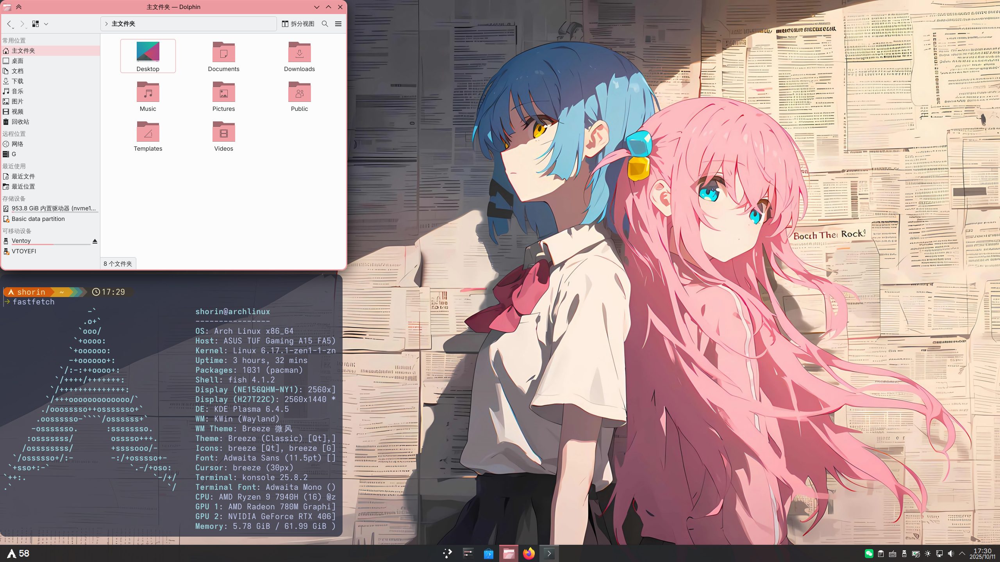

目录

- [桌面编辑](KDE配置#桌面编辑)
  - [桌面鼠标功能](KDE配置#桌面鼠标功能)
  - [桌面组件](KDE配置#桌面组件)
  - [桌面面板(任务栏)](KDE配置#桌面面板任务栏)
- [截图软件设置](KDE配置#截图软件设置)
- [系统设置](KDE配置#系统设置)
  - [快捷键](KDE配置#快捷键)
  - [无障碍辅助](KDE配置#无障碍辅助)
  - [窗口管理](KDE配置#窗口管理)
  - [窗口行为](KDE配置#窗口行为)
  - [桌面特效](KDE配置#桌面特效)
  - [虚拟桌面](KDE配置#虚拟桌面)
- [主题美化](KDE配置#主题美化)
  - [更换桌面壁纸](KDE配置#更换桌面壁纸)
  - [更换锁屏壁纸](KDE配置#更换锁屏壁纸)
  - [文字和字体](KDE配置#文字和字体)
  - [全局主题](KDE配置#全局主题)
- [用户头像](KDE配置#用户头像)
---

## 这是我的kde



## 桌面编辑

### 桌面鼠标功能

右键桌面>桌面和壁纸>鼠标操作>添加操作

1. 中键 程序启动器
2. 垂直滚动滚轮 切换桌面

### 桌面组件

#### wallpaper effects

这个组件可以在聚焦窗口时模糊桌面

右键进入编辑模式>左上角添加组件>获取新挂件>下载plasma挂件>搜索安装wallpaper effects，或者从aur安装

```
yay -S plasma6-applets-wallpaper-effects
```

添加到桌面后进行配置：blur radius 改成 30；pixelate effect的enbale改成never；grain改成never；color effects改成never；激活rounded corners，radius改成15

#### Apdatifier

更新相关的桌面组件

#### kdeconnect

```
sudo pacman -S kdeconnect
```

可以和手机传输文件，共享剪贴板。手机也需要下载kde connect。

### 桌面面板（任务栏）

右键任务栏（kde里叫面板），显示面板配置。设置为半透明；悬浮改成仅小程序；显示隐藏改成避开窗口；删除工作区、显示桌面相关组件；添加两个间隔，把开始菜单和软件移动到中心。

#### 右下角组件

点击时间左边的上箭头，在弹出来的窗口的右上角开启系统托盘设置，项目里面按需设置。我会设置电量和电池总是显示，蓝牙总是隐藏。

## 截图软件设置

打开spectacle的设置

常规页面勾选“保存文件到默认文件夹”，再点击这行字下面的框，选择复制到剪贴板。

## 系统设置

### 快捷键

系统设置 > 输入和输出 > 键盘 > 快捷键

- 应用程序

  KRuner: meta+Z

  浏览器： meta+B

  系统设置：启动：Ctrl+alt+S

  新增：任务中心（missioncenter）： meta+esc

  konsole终端：Meta+T


- 窗口管理：

  磁贴编辑开关：meta+f9

  关闭窗口：meta+Q

  强制终止窗口：meta+crtl+Q

  全屏显示窗口：meta+alt+F

  显示隐藏桌面总览：meta

  移动窗口到中央：meta+C

  暂时显示桌面：meta+M

  自定义快速铺放窗口到上下左右：meta+WASD

  然后打开磁铁编辑器编辑一个自己喜欢的布局

  最大化窗口：meta+F

  最小化窗口：meta+H

- plasma工作空间

  激活应用程序启动器： alt

  显示活动切换器： meta+TAB

### 无障碍辅助

“抖动后放大光标”调到最大（不是）

### 窗口管理

系统设置>窗口和应用>窗口管理

### 窗口行为

标题栏操作

鼠标滚轮：移动到上个/下个桌面

### 桌面特效

- 窗口惯性晃动

  激活窗口惯性晃动，启用高级设置，调整效果到自己喜欢的程度。我的设置是25、70、15

- geometry change

  点击获取新效果，这个要加载很久很久。下载geometry change，或者从aur安装。从aur安装的话需要重新打开系统设置。

  ```
  yay -S kwin-effects-geometry-change
  ```

  这可以给窗口的快捷键平铺添加动画。动画速度设置为500ms

- 窗口透明度

  激活窗口透明度，按照喜好设置

- 窗口背景虚化和背景对比度

  按需设置

- rounded corners（圆角）

  ```
  yay -S kwin-effect-rounded-corners-git
  ```

  ```
  reboot
  ```

  - 圆角页面

    圆角半径都改为15，取消激活平铺时禁用圆角

  - 轮廓

    主轮廓的活动窗口轮廓粗细改成2，激活使用装饰色：高亮；非活动窗口的粗细改成0；

    次轮廓的活动窗口轮廓粗细改成1，激活使用装饰色：高亮；非活动窗口的粗细改成0；

    取消激活平铺时禁用轮廓。

### 虚拟桌面

按需增加，激活切换时显示屏幕提示，改成500ms

## 主题美化

### 更换桌面壁纸

系统设置>外观和样式>壁纸

按需选择壁纸类型

这里有一个小技巧，如果你按住左键把一张图片从dolphin拖放到桌面上，会跳出来一个菜单。

### 更换锁屏壁纸

系统设置>安全和隐私>锁屏>配置外观

按需选择壁纸类型

### 文字和字体

系统设置>外观和样式>文字和字体

我喜欢用adwaita字体，大小11pt

### 全局主题

我觉得breeze已经挺漂亮了，就不下载第三方主题了。

系统设置>外观和样式>颜色和主题

- 颜色

  breeze微风经典

  基于壁纸获取强调色，或者选择自定义强调色，从壁纸上提取一个合适的颜色

- 应用程序外观样式

​		选择默认的breeze 微风，点击右下角的画笔配置，菜单透明度往左2格

- plasma 外观和样式

​		breeze微风深色

- 窗口装饰元素

​		breeze微风。点击右下角的笔，设置按钮大小。配置标题栏按钮，按需调整

- 光标

​		breeze 微风深色，大小30
- sddm主题
                
  breeze

- 登录屏幕

​		换一个壁纸

## 用户头像

系统设置 > 系统 > 用户

更换一个自己喜欢的头像。

## 下一节：[终端美化](终端美化)